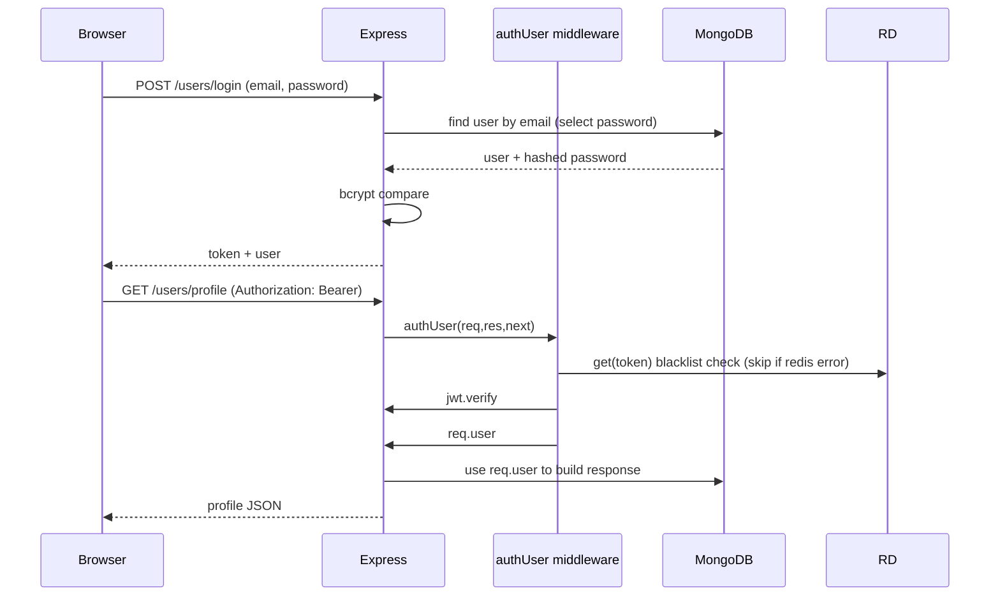
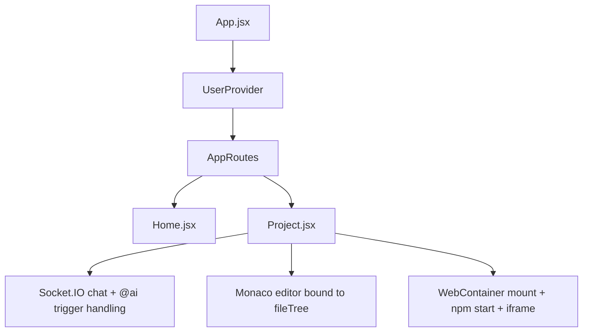
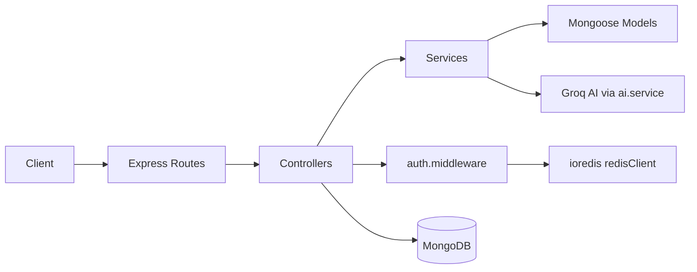
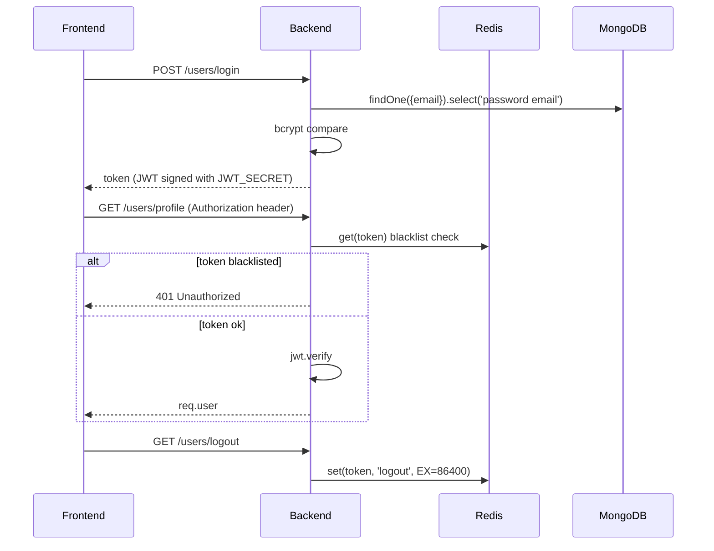

# Soen-AI Software Engineer

> **Real-time collaborative projects + AI-assisted code generation** (Socket.IO chat + live file editing + WebContainer “run”).

<!-- Banner placeholder -->

## Badges

- **Backend**: Node.js + Express
- **Frontend**: React + Vite + TailwindCSS
- **Database**: MongoDB + Mongoose
- **Real-time**: Socket.IO
- **AI**: Groq (via `groq-sdk`)

## Project Status

- Active / feature-complete for: authentication, projects, collaborative chat, AI code responses, and in-browser “run”.

## Current Version

- Backend: **1.0.0** (`Soen/Backend/package.json`)
- Frontend: **0.0.0** (`Soen/Frontend/package.json`)

## License

- **MIT** (see `Soen/Frontend/LICENSE`)

## Build Status

- **Not implemented** in repository (no CI workflow files detected during analysis).

## Stars

- **Placeholder**: N/A

## Last Updated

- **Not available from repository metadata** (no reliable timestamp found in analyzed files).

---

## Table of Contents

- [Project Overview](#project-overview)
- [Live Demo](#live-demo)
- [Screenshots](#screenshots)
- [Features](#features)
- [Technology Stack](#technology-stack)
- [System Architecture](#system-architecture)
  - [Overall Architecture](#overall-architecture)
  - [Request Flow](#request-flow)
  - [Frontend Architecture](#frontend-architecture)
  - [Backend Architecture](#backend-architecture)
  - [Database Flow](#database-flow)
  - [Authentication Flow](#authentication-flow)
  - [Deployment Architecture](#deployment-architecture)
- [Folder Structure](#folder-structure)
- [Installation Guide](#installation-guide)
  - [Prerequisites](#prerequisites)
  - [Clone](#clone)
  - [Install](#install)
  - [Setup](#setup)
  - [Environment Variables](#environment-variables)
  - [Database](#database)
  - [Run Development](#run-development)
  - [Run Production](#run-production)
- [Environment Variables](#environment-variables)
- [Project Workflow](#project-workflow)
- [Database](#database)
  - [Schema Overview](#schema-overview)
  - [Entity Details](#entity-details)
  - [Indexes & Constraints](#indexes--constraints)
  - [ER Diagram](#er-diagram)
- [API Documentation](#api-documentation)
- [Authentication & Authorization](#authentication--authorization)
- [Security](#security)
- [Performance Optimizations](#performance-optimizations)
- [Error Handling](#error-handling)
- [Project Structure Explanation](#project-structure-explanation)
- [Code Quality](#code-quality)
- [Deployment](#deployment)
- [Testing](#testing)
- [Troubleshooting](#troubleshooting)
- [FAQ](#faq)
- [Roadmap](#roadmap)
- [Contributing Guide](#contributing-guide)
- [Coding Standards](#coding-standards)
- [License](#license-1)
- [Author](#author)
- [Acknowledgements](#acknowledgements)
- [Final Technical Review](#final-technical-review)
- [Scorecard](#scorecard)
- [Missing Best Practices](#missing-best-practices)
- [Final Verdict](#final-verdict)

---

## Project Overview

### Why the project exists

Developers frequently need a **shared workspace** where teammates can:

- discuss changes in a **project-scoped chat**
- **agree on implementations** and apply suggestions quickly
- generate or update code via an **AI assistant**
- collaboratively maintain an evolving in-memory file tree

This repository provides a working MERN-style application that combines:

1. **Project management** (create projects, add collaborators)
2. **Project-scoped real-time chat** (Socket.IO)
3. **AI assistant** triggered by `@ai` inside chat messages
4. **Live file editing** using a stored `fileTree` on the project
5. **Run capability** using WebContainer to mount the generated file tree

### Real-world problem

Teams can waste time switching between:

- chat tools
- code editors
- local dev environments
- AI tools

Soen-AI reduces friction by keeping the “source of truth” (the project file tree) inside the application and broadcasting AI-generated file updates.

### Target users

- Student teams learning MERN + real-time apps
- Small developer teams collaborating on starter projects
- Developers who want an AI-assisted “pair-programming” workflow

### Business value

- faster iteration cycles (chat → AI → file update)
- reduced coordination overhead (project room scoped messaging)
- quick prototyping (WebContainer “Run”)

### Technical value

- real-time architecture (Socket.IO rooms)
- secure-ish JWT auth with token blacklist stored in Redis
- structured AI responses using Groq JSON format when generating file trees

### Why this solution is useful

It implements an end-to-end flow:

- **REST APIs** for auth and project management
- **WebSockets** for collaborative chat + AI-triggered updates
- **AI integration** that can return either free text or a **fileTree** object
- **File mounting and running** in the browser via WebContainer

---

## Live Demo

- **Placeholder**: No hosted demo environment found in repository.

---

## Screenshots

> **Placeholders** (images not present in repository under the analyzed paths).

- **Desktop**: _Not available_ 
- **Tablet**: _Not available_
- **Mobile**: _Not available_
- **Dark Mode**: _Partially supported_ (Monaco uses `vs-dark` editor theme)
- **Dashboard**: _UI exists_ (`Frontend/src/screens/Home.jsx`)
- **Authentication**: _UI exists_ (`Frontend/src/screens/Login.jsx`, `Register.jsx`)
- **Important Features**: _UI exists_ (project page contains chat + collaborator panel + code editor)

---

## Features

### Core Features

1. **JWT authentication**
   - User registration and login return a JWT.
   - Protected REST routes use `authUser` middleware.

2. **Project management (REST)**
   - Create project (`POST /projects/create`)
   - List user projects (`GET /projects/all`)
   - Add collaborators (`PUT /projects/add-user`)

3. **Project file tree storage**
   - Each project stores `fileTree` as an object in MongoDB.
   - File tree can be updated via REST (`PUT /projects/update-file-tree`).

4. **Real-time project chat (Socket.IO)**
   - Clients join a Socket.IO room per project.
   - Messages are broadcast to the room.

5. **AI assistant triggered by `@ai`**
   - When a chat message includes `@ai`, backend generates a response via Groq.
   - If the AI response contains `fileTree`, the project’s `fileTree` is merged and saved.
   - AI messages are emitted with sender `{ _id: "ai", email: "AI" }`.

6. **Collaborative editing experience**
   - Frontend receives `fileTree` updates through `project-message` events.
   - Monaco editor shows the current file content from `fileTree`.

7. **Run generated project via WebContainer**
   - Frontend mounts the `fileTree` into a WebContainer and runs `npm install` and `npm start`.
   - Frontend parses output for a local URL and embeds it in an `<iframe>`.

### Advanced Features

- **Redis-backed token blacklist** (logout)
  - `logoutController` stores the token in Redis.
  - `authUser` checks Redis before accepting a token.

- **AI supports structured file responses**
  - Backend detects “code prompt” heuristically.
  - For code prompts, it requests Groq responses in a JSON object format.
  - JSON can include:
    - `text` (human readable)
    - `fileTree` (object mapping filenames → `{ content: string }`)

### Security Features

- **JWT verification**
- **Token blacklist via Redis**
- **Request validation with express-validator** for REST endpoints

### Performance Features

- **WebSocket rooms**: per-project message broadcasting (`socket.join(socket.roomId)`)
- **Frontend lazy WebContainer boot**: only booted on project fetch when needed.

### Developer Features

- **Monaco editor integration** for local edits and file tree manipulation.
- **Pluggable AI prompt handling** in `Backend/services/ai.service.js`.

### Future Features

- **Not implemented** in analyzed code:
  - server-side live collaborative conflict resolution
  - granular file-level locking
  - streaming AI responses
  - CI/CD and automated tests

---

## Technology Stack

### Frontend

| Category | Used in this repo |
|---|---|
| Framework | React (`react`, `react-router-dom`) |
| Build Tool | Vite (`vite`, `@vitejs/plugin-react`) |
| Styling | TailwindCSS (`tailwindcss`) |
| Code Editor | Monaco Editor (`@monaco-editor/react`) |
| Real-time | Socket.IO Client (`socket.io-client`) |
| Run Sandbox | WebContainer (`@webcontainer/api`) |
| HTTP | Axios (`axios`) |
| Markdown | markdown-to-jsx (`markdown-to-jsx`) |

### Backend

| Category | Used in this repo |
|---|---|
| Runtime | Node.js |
| Web Framework | Express (`express`) |
| Real-time | Socket.IO (`socket.io`) |
| Auth | JWT (`jsonwebtoken`) |
| Validation | express-validator (`express-validator`) |
| Cookies | cookie-parser (`cookie-parser`) |
| DB | MongoDB via Mongoose (`mongoose`) |
| Cache/Blacklist | ioredis (`ioredis`) |
| Logging | morgan (`morgan`) |
| AI provider | Groq (`groq-sdk`) |

### Database

| Category | Used in this repo |
|---|---|
| MongoDB | Project file tree + user/projects |
| Mongoose models | `User`, `Project` |

### Authentication

| Category | Used in this repo |
|---|---|
| JWT | Stored in localStorage on frontend and verified in middleware |
| Logout blacklist | Redis token key set to `logout` |

### DevOps / Hosting

| Category | Status |
|---|---|
| CI/CD | **Not implemented** (no workflows observed) |
| Observability | **Partially** via logs/morgan; no structured tracing detected |

### Build Tools / Package Manager / Testing

| Category | Used in this repo |
|---|---|
| Package Manager | npm (from `package-lock.json`) |
| Testing | **Not implemented** (backend `test` script returns error) |

---

## System Architecture

### Overall Architecture

```mermaid
flowchart LR
  U[Developer Users] -->|HTTP REST| FE[Frontend (React)]
  FE -->|HTTP /users /projects /ai| BE[Backend (Express + Socket.IO)]
  FE -->|WebSocket events| BE
  BE -->|MongoDB queries| DB[(MongoDB)]
  BE -->|AI requests| AI[Groq API]
  BE -->|Redis token blacklist| RD[(Redis)]
  FE -->|Mount & run| WC[WebContainer]
```

### Request Flow



### Frontend Architecture



Key frontend modules:

- `Frontend/src/config/axios.js`: attaches `Authorization: Bearer <token>`
- `Frontend/src/config/socket.js`: initializes Socket.IO with `auth.token` and `query.projectId`
- `Frontend/src/screens/Project.jsx`: chat UI, file explorer, Monaco editor, WebContainer run

### Backend Architecture



Route modules:

- `Backend/routes/user.routes.js`
- `Backend/routes/project.routes.js`
- `Backend/routes/ai.routes.js`

Socket server:

- `Backend/server.js`
- uses `io.use(...)` to authenticate tokens and load `socket.project`

### Database Flow

```mermaid
flowchart TD
  User[User] -->|owns| Project[Project]
  Project -->|stores| FileTree[fileTree: object]

  Chat[@ai chat] -->|updates| Project
  Project --> Mongo
```

### Authentication Flow



### Deployment Architecture

```mermaid
flowchart LR
  DevMachine[Developer machine] -->|npm start| Backend
  DevMachine -->|npm run dev| Frontend

  Backend --> MongoDB
  Backend --> Redis (optional but expected for logout blacklist)
  Backend --> Groq API (AI)
```

### Notes about WebContainer deployment

WebContainer booting and mounting happens entirely in the browser; no server-side container exists in this codebase.

---

## Folder Structure

> Repository contains three projects: **Soen** (this README target), plus other unrelated directories in the workspace.

Inside **Soen/**:

```text
Soen/
├─ README.md
├─ CHANGELOG.md
├─ package-lock.json
├─ Backend/
│  ├─ app.js
│  ├─ server.js
│  ├─ package.json
│  ├─ controllers/
│  │  ├─ ai.controller.js
│  │  ├─ project.controller.js
│  │  └─ user.controller.js
│  ├─ db/
│  │  └─ db.js
│  ├─ middleware/
│  │  └─ auth.middleware.js
│  ├─ models/
│  │  ├─ project.model.js
│  │  └─ user.model.js
│  ├─ routes/
│  │  ├─ ai.routes.js
│  │  ├─ project.routes.js
│  │  └─ user.routes.js
│  └─ services/
│     ├─ ai.service.js
│     ├─ project.service.js
│     ├─ redis.service.js
│     └─ user.service.js
└─ Frontend/
   ├─ index.html
   ├─ vite.config.js
   ├─ package.json
   ├─ README.md
   ├─ LICENSE
   └─ src/
      ├─ App.jsx
      ├─ main.jsx
      ├─ auth/
      │  └─ UserAuth.jsx
      ├─ config/
      │  ├─ axios.js
      │  └─ socket.js
      ├─ context/
      │  └─ user.context.jsx
      ├─ routes/
      │  └─ AppRoutes.jsx
      └─ screens/
         ├─ Home.jsx
         ├─ Login.jsx
         ├─ Register.jsx
         └─ Project.jsx
```

### Important files (Soen/Backend)

| File | Purpose |
|---|---|
| `Backend/app.js` | Express app setup and REST route mounting |
| `Backend/server.js` | Socket.IO server + AI trigger logic |
| `Backend/middleware/auth.middleware.js` | JWT verification + Redis blacklist |
| `Backend/models/user.model.js` | User schema + JWT helper methods |
| `Backend/models/project.model.js` | Project schema (`name`, `users`, `fileTree`) |
| `Backend/services/ai.service.js` | Groq API integration and response parsing |
| `Backend/services/redis.service.js` | Redis client + connection |

### Important files (Soen/Frontend)

| File | Purpose |
|---|---|
| `Frontend/src/screens/Project.jsx` | Chat UI, file tree editor, collaborator management, WebContainer run |
| `Frontend/src/config/socket.js` | Socket.IO initialization and message send/receive helpers |
| `Frontend/src/config/axios.js` | axios baseURL and auth header interceptor |
| `Frontend/src/auth/UserAuth.jsx` | Route guard using `/users/profile` |

---

## Installation Guide

### Prerequisites

- Node.js compatible with repository:
  - Backend/Frontend: **Node >= 22.x** (frontend specifies `engines.node: 22.x`)
- MongoDB running and reachable via `MONGODB_URI`
- (Recommended) Redis running for logout blacklist checks
- Groq API key for AI (`GROQ_API_KEY`)

### Clone

```bash
git clone https://github.com/Jitendra-Kumar123/soen-ai-engineer.git
cd soen-ai-engineer
```

> Note: this README targets the `Soen/` directory structure present in your workspace; adjust working directory accordingly.

### Install

Backend:

```bash
cd Soen/Backend
npm install
```

Frontend:

```bash
cd ../Frontend
npm install
```

### Setup

1. Create `.env` inside **Soen/Backend** (code uses backend env):

See [Environment Variables](#environment-variables) for required keys.

2. Create `VITE_API_URL` for the frontend.

### Environment Variables

See dedicated section below.

### Database

MongoDB is connected via:

- `Backend/db/db.js`: `mongoose.connect(process.env.MONGODB_URI)`

### Run Development

Backend:

```bash
cd Soen/Backend
npm run dev
```

Frontend:

```bash
cd Soen/Frontend
npm run dev
```

Then open the frontend in the browser.

### Run Production

This repo does **not** include production build automation or containerization.

- Backend production start:
  ```bash
  cd Soen/Backend
  npm run start
  ```
- Frontend production build + preview:
  ```bash
  cd Soen/Frontend
  npm run build
  npm run preview
  ```

---

## Environment Variables

> Variables are read from `process.env` in backend and `import.meta.env` in frontend.

### Backend environment variables

| Variable | Purpose | Required | Example | Default |
|---|---|---|---|---|
| `PORT` | Backend HTTP + Socket.IO listen port | Optional (fallback `3000`) | `3000` | `3000` |
| `MONGODB_URI` | MongoDB connection string | **Required** (connect expects it) | `mongodb://localhost:27017/soen` | — |
| `JWT_SECRET` | JWT signing/verifying secret | **Required** | `your_secret` | — |
| `GROQ_API_KEY` | Groq SDK apiKey | **Required** for AI to work | `...` | — |
| `REDIS_HOST` | Redis hostname | Optional (logout blacklist uses redis client; auth middleware tolerates redis errors) | `127.0.0.1` | — |
| `REDIS_PORT` | Redis port | Optional | `6379` | — |
| `REDIS_PASSWORD` | Redis password | Optional | `password` | — |

### Frontend environment variables

| Variable | Purpose | Required | Example | Default |
|---|---|---|---|---|
| `VITE_API_URL` | Backend base URL used by axios and socket client | Optional in code (axios has fallback) but recommended | `http://localhost:3000` | `http://localhost:3000` |

---

## Project Workflow

### Application lifecycle

1. User registers or logs in.
2. Frontend stores `token` in `localStorage`.
3. Frontend fetches `/users/profile` through `UserAuth` route guard.
4. User creates a project and/or adds collaborators.
5. Frontend opens the project room over Socket.IO.
6. Chat messages are exchanged in real time.
7. When user types a message containing `@ai`, backend calls Groq.
8. If AI returns `fileTree`, backend merges it into the MongoDB project.
9. Frontend receives the updated `fileTree` and updates the Monaco editor.
10. User can click **Run** to mount the file tree in WebContainer and start the app.
