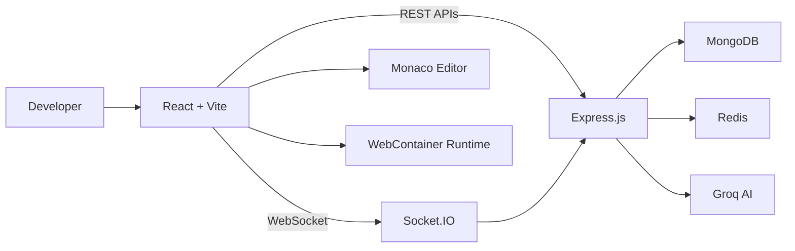
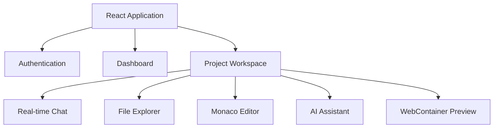
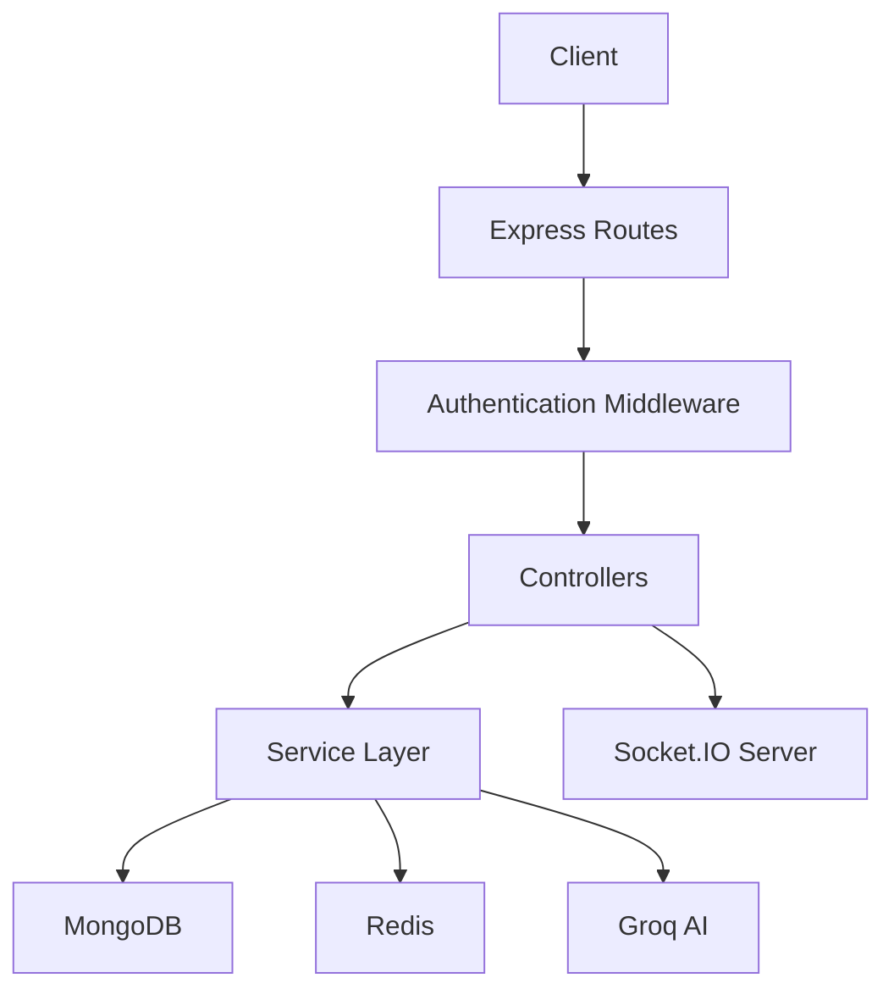
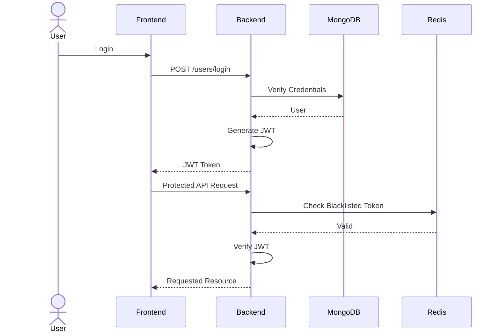
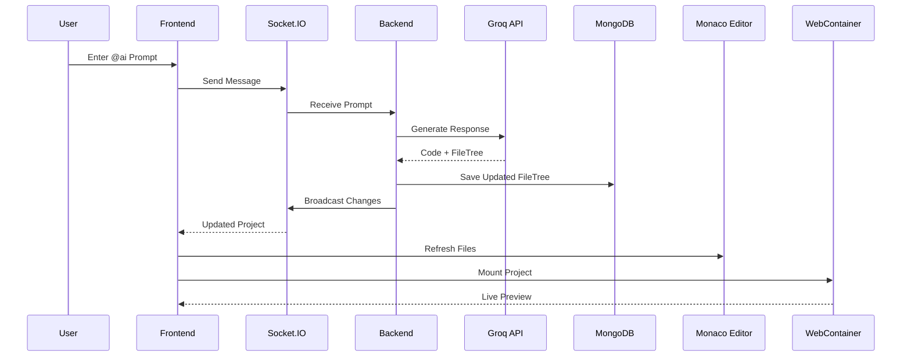
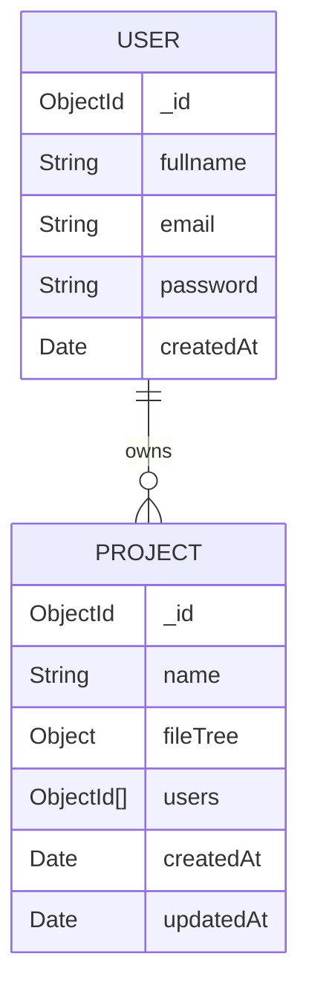
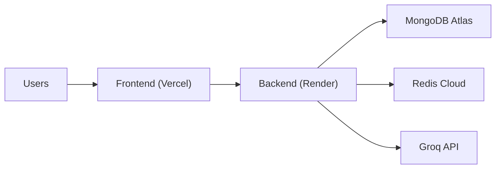

# 🚀 Soen-AI Software Engineer

> **A real-time collaborative coding platform powered by AI that enables teams to chat, generate code, edit files collaboratively, and run projects directly in the browser using WebContainer.**

<p align="center">


</p>

---

## 📖 Table of Contents

- Project Overview
- Features
- Technology Stack
- System Design
- High-Level Architecture
- Component Architecture
- Backend Architecture
- Authentication Flow
- AI Workflow
- Request Lifecycle
- Database Design
- Deployment Architecture
- Folder Structure
- API Overview
- Installation
- Environment Variables
- Future Improvements
- Author
- License

---

# 📌 Project Overview

Soen-AI Software Engineer is a **real-time collaborative development platform** built using the MERN stack. It combines AI-assisted code generation, live collaboration, project management, and browser-based code execution into a single workspace.

The platform allows multiple developers to collaborate inside a project, communicate through real-time chat, generate code using AI, edit files together, and instantly execute applications without installing dependencies locally.

The primary objective is to eliminate constant context switching between chat applications, AI tools, code editors, and local development environments by bringing everything together into one collaborative workspace.

---

# ✨ Features

## 🔐 Authentication

- Secure JWT Authentication
- User Registration & Login
- Protected Routes
- Token Blacklisting using Redis
- Persistent User Sessions

---

## 📁 Project Management

- Create Projects
- Manage Team Members
- Add Collaborators
- Shared Workspace
- Project-specific File Tree

---

## 💬 Real-Time Collaboration

- Socket.IO powered communication
- Instant Project Chat
- Live Collaboration
- Project Rooms
- Real-time Updates

---

## 🤖 AI Code Assistant

- AI-powered Code Generation
- Smart File Generation
- Context-aware Responses
- Automatic File Tree Updates
- Groq API Integration

---

## 💻 Code Editor

- Monaco Editor
- Multi-file Editing
- Syntax Highlighting
- Live File Updates
- Markdown Rendering

---

## 🚀 Browser Execution

- WebContainer Integration
- Run Projects Inside Browser
- Automatic Dependency Installation
- Live Preview
- Zero Local Setup

---

## 🔒 Security

- JWT Authentication
- Password Hashing
- Protected APIs
- Request Validation
- Redis Token Blacklisting

---

# 🛠 Technology Stack

| Category | Technologies |
|-----------|--------------|
| Frontend | React, Vite, Tailwind CSS |
| Backend | Node.js, Express.js |
| Database | MongoDB, Mongoose |
| Authentication | JWT, Bcrypt |
| Real-Time | Socket.IO |
| AI | Groq API |
| Runtime | WebContainer API |
| Code Editor | Monaco Editor |
| Cache | Redis |
| HTTP Client | Axios |
| Validation | Express Validator |

---

# 🏗 System Design

The application follows a modern client-server architecture with real-time communication and AI integration.

Major components include:

- React Frontend
- Express Backend
- MongoDB Database
- Redis Cache
- Socket.IO Server
- Groq AI Service
- WebContainer Runtime

The frontend communicates with the backend through REST APIs for standard operations and Socket.IO for real-time collaboration. AI-generated code is processed by the backend, stored in MongoDB, synchronized with connected clients, and executed inside WebContainer without requiring local setup.

---

## 🏗 Complete System Architecture



---

# 🧩 Component Architecture



---

# 🏛 Backend Architecture



---

➡️ **Next:** Part 2 will include:

- Authentication Flow
- AI Workflow
- Complete Request Lifecycle
- Database ER Diagram
- Deployment Architecture
- System Flow Diagrams

# 🔐 Authentication Flow



---

# 🤖 AI Workflow



---

# 🗂 Database Design



---

# 🌐 Deployment Architecture



---


# 🧠 AI System Design

```mermaid
flowchart LR

User["User Prompt"]

User --> Backend["Backend"]

Backend --> Prompt["Prompt Engineering"]

Prompt --> Groq["Groq API"]

Groq --> Response["AI Response"]

Response --> Parser["Parse File Tree"]

Parser --> Database["MongoDB"]

Database --> Socket["Socket.IO"]

Socket --> Frontend["Frontend"]

Frontend --> Editor["Monaco Editor"]

Editor --> Runtime["WebContainer"]
```



---


# 🏗 Design Principles

The project follows modern software engineering principles to ensure scalability, maintainability, and modular development.

### Architectural Principles

- Modular Folder Structure
- Service Layer Architecture
- RESTful API Design
- Component-based Frontend
- Event-driven Communication using Socket.IO
- Separation of Concerns
- Stateless Authentication using JWT
- Centralized Business Logic
- Reusable Services
- Scalable Database Design

---

# 🚀 Performance Optimizations

- Socket.IO Rooms for Project Isolation
- Redis Token Lookup
- MongoDB Indexing
- Component-based Rendering
- Efficient FileTree Synchronization
- Lazy WebContainer Initialization
- Persistent JWT Authentication
- Optimized REST APIs
- Reduced Network Calls
- Real-time Incremental Updates

# 📂 Folder Structure

```text
Soen-AI/
│
├── Backend/
│   ├── controllers/
│   ├── db/
│   ├── middleware/
│   ├── models/
│   ├── routes/
│   ├── services/
│   ├── app.js
│   ├── server.js
│   └── package.json
│
├── Frontend/
│   ├── public/
│   ├── src/
│   │   ├── auth/
│   │   ├── components/
│   │   ├── config/
│   │   ├── context/
│   │   ├── routes/
│   │   ├── screens/
│   │   ├── App.jsx
│   │   └── main.jsx
│   ├── vite.config.js
│   └── package.json
│
├── README.md
└── LICENSE
```

---

# 📡 API Overview

## Authentication APIs

| Method | Endpoint | Description |
|---------|----------|-------------|
| POST | `/users/register` | Register a new user |
| POST | `/users/login` | Authenticate user |
| GET | `/users/profile` | Get authenticated user |
| GET | `/users/logout` | Logout current user |

---

## Project APIs

| Method | Endpoint | Description |
|---------|----------|-------------|
| POST | `/projects/create` | Create Project |
| GET | `/projects/all` | Get All Projects |
| PUT | `/projects/add-user` | Add Collaborator |
| PUT | `/projects/update-file-tree` | Update Project Files |

---

## AI APIs

| Method | Endpoint | Description |
|---------|----------|-------------|
| POST | `/ai/get-result` | Generate AI Response |

---

# ⚙ Installation

## Clone Repository

```bash
git clone https://github.com/yourusername/soen-ai.git
```

```bash
cd soen-ai
```

---

## Install Backend

```bash
cd Backend
npm install
```

---

## Install Frontend

```bash
cd ../Frontend
npm install
```

---

# 🔑 Environment Variables

## Backend (.env)

```env
PORT=3000

MONGODB_URI=

JWT_SECRET=

GROQ_API_KEY=

REDIS_HOST=

REDIS_PORT=

REDIS_PASSWORD=
```

---

## Frontend (.env)

```env
VITE_API_URL=http://localhost:3000
```

---

# 🚀 Running the Application

## Start Backend

```bash
cd Backend
npm run dev
```

---

## Start Frontend

```bash
cd Frontend
npm run dev
```

---

## Production Build

### Frontend

```bash
npm run build
```

---

### Backend

```bash
npm start
```

---

# 📦 Main Dependencies

## Frontend

- React
- React Router DOM
- Axios
- Tailwind CSS
- Monaco Editor
- Socket.IO Client
- Markdown to JSX
- WebContainer API

---

## Backend

- Express
- Mongoose
- Socket.IO
- JSON Web Token
- Bcrypt
- Cookie Parser
- Morgan
- Express Validator
- Redis
- Groq SDK

---

# 📁 Core Modules

## Frontend

| Module | Purpose |
|---------|----------|
| Authentication | User Login & Registration |
| Dashboard | Project Listing |
| Project Workspace | Collaboration |
| Monaco Editor | Code Editing |
| WebContainer | Browser Runtime |
| Socket Client | Real-time Communication |

---

## Backend

| Module | Purpose |
|---------|----------|
| Controllers | Handle Requests |
| Services | Business Logic |
| Models | Database Models |
| Middleware | Authentication |
| Routes | REST APIs |
| Socket Server | Real-time Collaboration |

---

# 🔄 Application Workflow

```text
User Login

↓

Dashboard

↓

Create / Open Project

↓

Join Socket Room

↓

Real-time Collaboration

↓

AI Prompt

↓

Groq Response

↓

Database Update

↓

Socket Broadcast

↓

Editor Update

↓

Run in WebContainer

↓

Live Preview
```

---

# 🛡 Security Features

- JWT Authentication
- Password Hashing using Bcrypt
- Protected REST APIs
- Express Validator
- Redis Token Blacklisting
- Authorization Middleware
- Secure Cookie Support
- Input Validation

---

# ⚡ Performance Features

- Socket.IO Rooms
- Optimized REST APIs
- Lazy WebContainer Boot
- Efficient MongoDB Queries
- Component-based Rendering
- Real-time Synchronization
- Persistent Sessions
- Reduced API Calls

# 🚀 Future Improvements

The current version provides a complete AI-powered collaborative development platform. The following enhancements are planned for future releases.

## Collaboration

- Live Cursor Tracking
- Real-time Collaborative Editing
- File Locking
- Conflict Resolution
- Presence Indicators
- Typing Indicators
- Voice Collaboration
- Video Collaboration

---

## AI Features

- Streaming AI Responses
- Multi-Model Support
- Code Explanation
- Code Refactoring
- Bug Detection
- Unit Test Generation
- Documentation Generation
- AI Chat History
- Prompt Templates
- AI Code Review

---

## Project Management

- Project Templates
- Team Roles
- Role-based Permissions
- Project Analytics
- Activity Timeline
- File Version History
- Restore Previous Versions

---

## Developer Experience

- Docker Support
- Docker Compose
- Kubernetes Deployment
- CI/CD Pipeline
- GitHub Actions
- ESLint
- Prettier
- Husky Git Hooks

---

## Security

- Refresh Tokens
- Email Verification
- Two-Factor Authentication
- Password Reset
- OAuth Authentication
- API Rate Limiting
- Helmet Security
- CSRF Protection

---

## Performance

- Redis Caching
- Horizontal Scaling
- Load Balancer
- CDN Support
- Image Optimization
- Lazy Loading
- Code Splitting
- Database Optimization

---

## Testing

- Unit Testing
- Integration Testing
- End-to-End Testing
- API Testing
- Performance Testing

---

# 🤝 Contributing

Contributions are welcome and appreciated.

### Steps

1. Fork the repository

2. Create a new branch

```bash
git checkout -b feature/your-feature
```

3. Commit your changes

```bash
git commit -m "Add new feature"
```

4. Push to your branch

```bash
git push origin feature/your-feature
```

5. Open a Pull Request

---
<!-- 
# 📸 Screenshots

> Replace these placeholders with actual screenshots.

## Login Page

```text
docs/screenshots/login.png
```

---

## Dashboard

```text
docs/screenshots/dashboard.png
```

---

## Project Workspace

```text
docs/screenshots/project.png
```

---

## AI Code Generation

```text
docs/screenshots/ai-chat.png
```

---

## Monaco Editor

```text
docs/screenshots/editor.png
```

---

## Live Preview

```text
docs/screenshots/webcontainer.png
```

--- -->

# 🌟 Project Highlights

- AI-assisted Software Engineering
- Real-time Collaboration
- Browser-based Code Execution
- AI Generated File Trees
- Socket.IO Communication
- WebContainer Integration
- Secure Authentication
- Modern MERN Architecture
- Modular Backend
- Responsive UI

---

# 📊 Tech Stack Summary

| Layer | Technology |
|--------|------------|
| Frontend | React + Vite |
| Styling | Tailwind CSS |
| Backend | Node.js + Express |
| Database | MongoDB |
| Authentication | JWT |
| Realtime | Socket.IO |
| AI | Groq API |
| Cache | Redis |
| Editor | Monaco Editor |
| Runtime | WebContainer |

---

# 👨‍💻 Author

**Jitendra Kumar**

### Connect with Me

GitHub

```
https://github.com/Jitendra-Kumar123
```

LinkedIn

```
https://www.linkedin.com/in/jitendrakumar-dev/
```

Portfolio

```
https://jitendra-portfolio.com
```

Email

```
.jitendra0202006@gmail.com 
.jitendrakumar.dev.cs@gmail.com
```

---

# 📄 License

This project is licensed under the **MIT License**.

Feel free to use, modify, and distribute this project in accordance with the license terms.

---

# ⭐ Support

If you found this project helpful:

- ⭐ Star the repository
- 🍴 Fork the repository
- 🐛 Report issues
- 💡 Suggest improvements
- 🤝 Contribute to the project

Your support helps improve the project and encourages further development.

---

# 🙌 Acknowledgements

Special thanks to the open-source community and the technologies that made this project possible.

- React
- Express.js
- MongoDB
- Socket.IO
- Redis
- Groq
- Monaco Editor
- WebContainer API
- Tailwind CSS
- Vite

---

<p align="center">

### Built with ❤️ using the MERN Stack, Socket.IO, Groq AI, and WebContainer.

**⭐ If you like this project, don't forget to give it a star! ⭐**

</p>